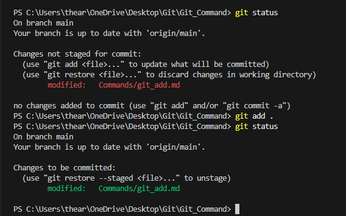

# Git Add Command  

## Overview  
The `git add` command is used to add changes from the working directory to the staging area. It prepares modified and new files for the next commit.  

## Usage  

To add a specific file to the staging area:  

```sh
git add <file_name>
```  

To add multiple specific files:  

```sh
git add <file1> <file2>
```  

To add all modified and new files in the current directory:  

```sh
git add .
```  

To add all files, including deleted ones:  

```sh
git add -A
```  

## Example  

### Adding a Single File  

```sh
git add index.html
```  

### Adding Multiple Files  

```sh
git add style.css script.js
```  

### Adding All Changes  

```sh
git add .
```  

This stages all new and modified files but does not include deleted files.  

### Adding All Changes, Including Deletions  

```sh
git add -A
```  

This stages all new, modified, and deleted files.  

## Verifying Staged Files  

After adding files, check the status using:  

[Git Status](git_status.md)

```sh
git status
```  

It will show the staged files under "Changes to be committed".  



## Conclusion  

The `git add` command is crucial for preparing changes before committing. It ensures that modifications, new files, and deletions are staged correctly for the next commit.  
