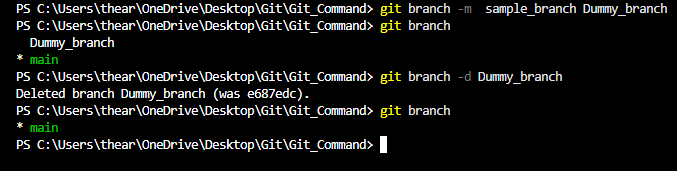
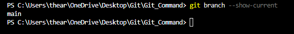

# Git Branch Command  

## Overview  
The `git branch` command is used to manage branches in a Git repository. It allows you to create, list, rename, and delete branches.  

## Usage  

### List all branches  

```sh
git branch
```  

### Create a new branch  

```sh
git branch <branch_name>
```  

### Rename a branch  

```sh
git branch -m <old_branch_name> <new_branch_name>
```  

### Delete a branch  

#### Delete a local branch  

```sh
git branch -d <branch_name>
```  

To force delete a branch (if it contains unmerged changes):  

```sh
git branch -D <branch_name>
```  

#### Delete a remote branch  

[Git_Remote](git_remote.md)

```sh
git push origin --delete <branch_name>
```  

## Example  

### Creating a New Branch  

```sh
git branch feature-login
``` 
 

### Renaming a Branch  

```sh
git branch -m old-branch new-branch
```  

### Deleting a Branch  

```sh
git branch -d feature-login
```  


## Viewing Current Branch  

To see which branch you're currently on, use:  

```sh
git branch --show-current
```  


## Conclusion  

The `git branch` command is essential for managing different versions of a project, enabling parallel development, and keeping code organized.  
