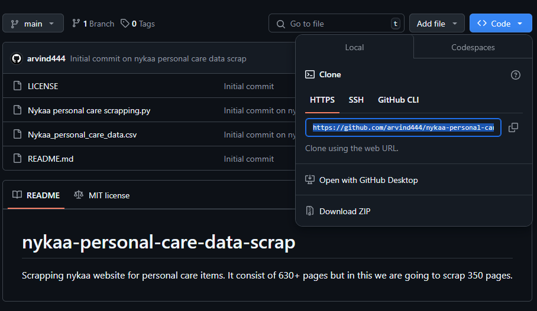
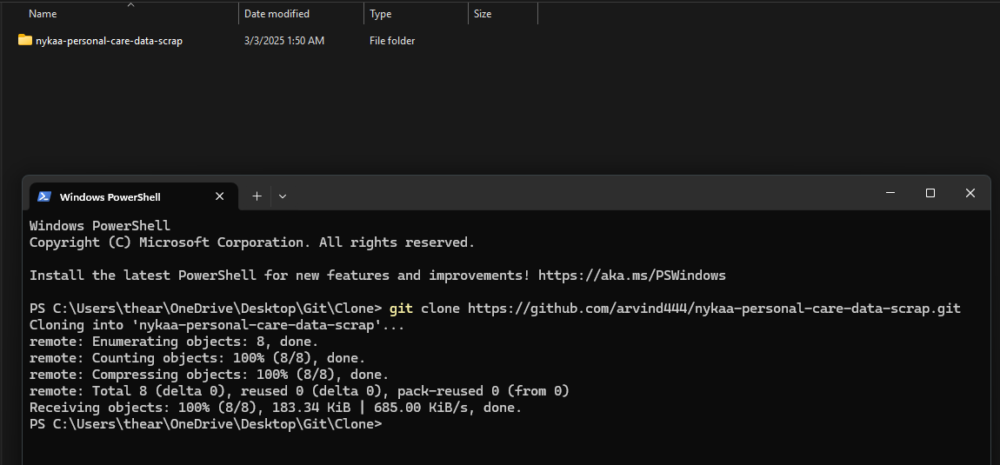
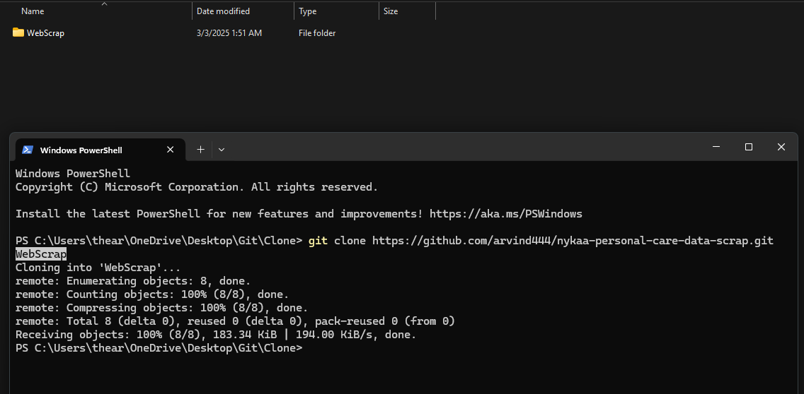
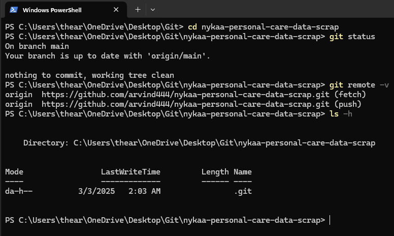

# Git Clone Command  

## Overview  
The `git clone` command is used to create a copy of an existing Git repository. It downloads the entire repository, including its history, from a remote source and sets it up locally.  

## Usage  

To clone a repository, use:  

```sh
git clone <repository_url>
```
  



To clone into a specific directory:  

```sh
git clone <repository_url> <directory_name>
```  


To clone only a specific branch:  

```sh
git clone --branch <branch_name> <repository_url>
```  

## Example  

Cloning a GitHub repository:  

```sh
git clone https://github.com/arvind444/nykaa-personal-care-data-scrap.git
```  

Cloning into a custom directory:  

```sh
git clone https://github.com/arvind444/nykaa-personal-care-data-scrap.git WebScrap
```  

Cloning only the `opengl_filter` branch:  

[Git Branch](git_branch.md)

```sh
 git clone --branch opengl_filter https://github.com/Genymobile/scrcpy.git
```  

## Verifying Cloning  

Once cloned, navigate to the repository directory:  

```sh
cd repository
```  

Check if Git is tracking the repository:  

```sh
git status
```  

List the remote repositories linked: 

[Git Remote](git_remote.md)

```sh
git remote -v
```  

## Hidden `.git` Folder  

When you clone a repository, a hidden `.git` directory is created inside the project. If hidden files are enabled, you will be able to see it.If note enabled, Run

Windows
```sh
ls -h 
```



## Conclusion  

The `git clone` command is a quick way to copy and start working with an existing repository while maintaining its history and connection to the remote source.  
