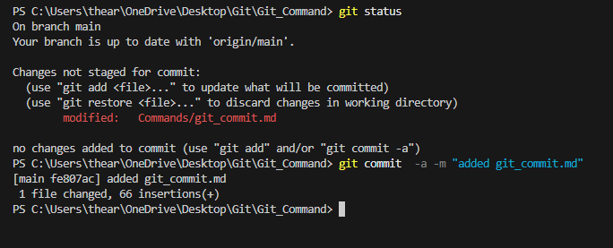
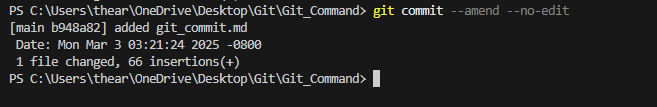

# Git Commit Command  

## Overview  
The `git commit` command records changes in the repository. It saves the staged modifications along with a commit message describing the changes.  

## Usage  

To commit staged changes with a message:  

```sh
git commit -m "Your commit message here"
```  

To commit all tracked changes (without using `git add`):  

```sh
git commit -a -m "Your commit message here"
```  

To amend the last commit (modify the message or add more changes):  

```sh
git commit --amend -m "Updated commit message"
```
To amend the last commit (without modifying the message):  

```sh
git commit --amend --no-edit
```

## Example  

### Committing Staged Changes  

```sh
git commit -m "Added new feature to homepage"
```  

### Committing All Changes Without Staging  

```sh
git commit -a -m "Updated styles and scripts"
```  


### Amending the Last Commit  

If you forgot to add a file or need to change the last commit message:  

```sh
git add missed-file.txt
git commit --amend -m "Fixed a bug and added missing file"
```  
If you forgot to add a file and don't want to change the last commit message:  

```sh
git add .
git commit --amend --no-edit
```


## Verifying Commits  

To check the commit history, use:  

[Git Log](git_log.md)

```sh
git log
```  

## Conclusion  

The `git commit` command is essential for saving changes in a Git repository. Every commit creates a snapshot of the project, allowing you to track progress and revert if needed.  
