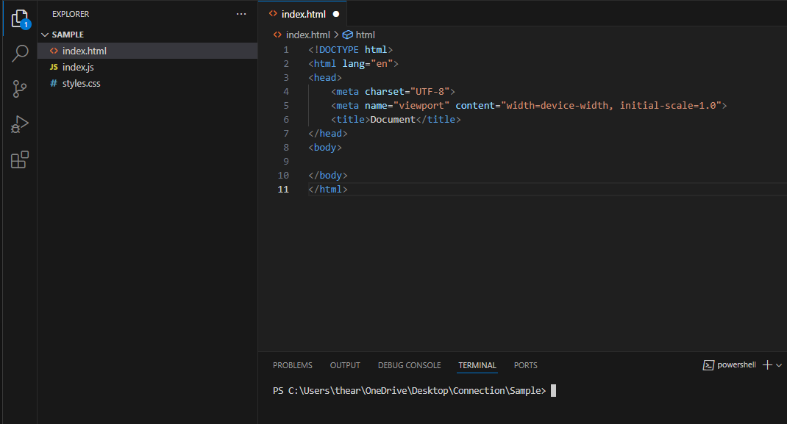
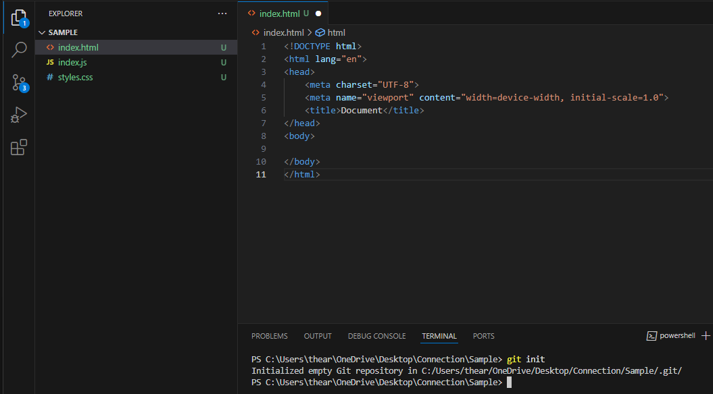
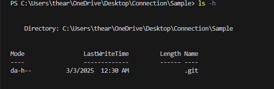
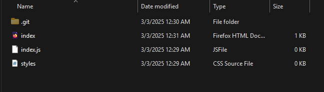

# Git Init Command  

## Overview  
The `git init` command initializes a new Git repository. It creates a hidden `.git` directory that stores all metadata and configuration files required for version control.  

## Usage  

To initialize a Git repository in the current directory, use:  

```sh
git init
```  
 

 

## Verifying Initialization  

To check if Git has been initialized, run:  

Windows
```sh
ls -h 
```  


You should see a `.git` directory. You can also check the repository status with:  

[Git Status](git_status.md)  

If hidden files are enabled, you will be able to see the `.git` folder in your project directory.  



## Conclusion  

The `git init` command is the first step in setting up version control for a new project, allowing you to track changes efficiently.  
