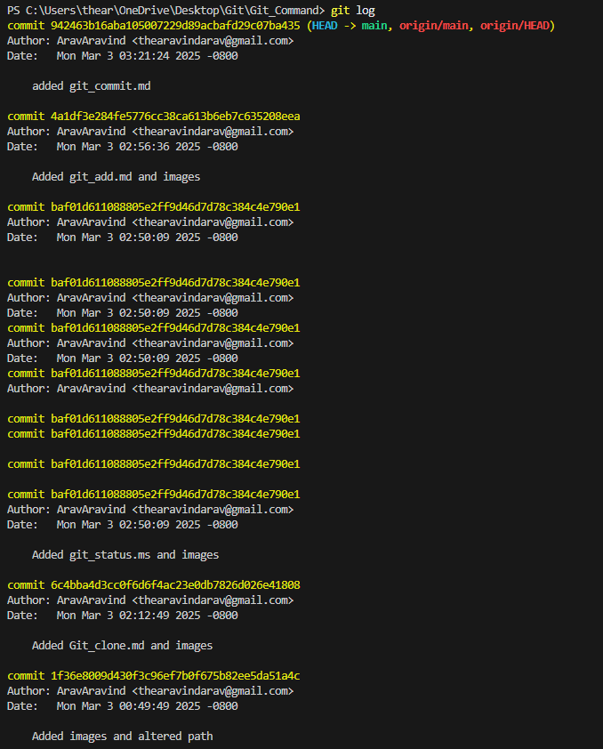
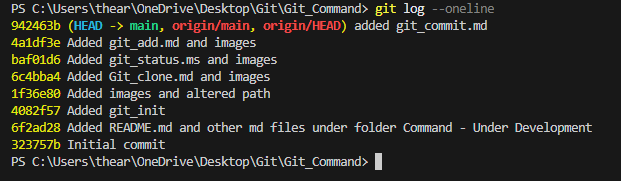
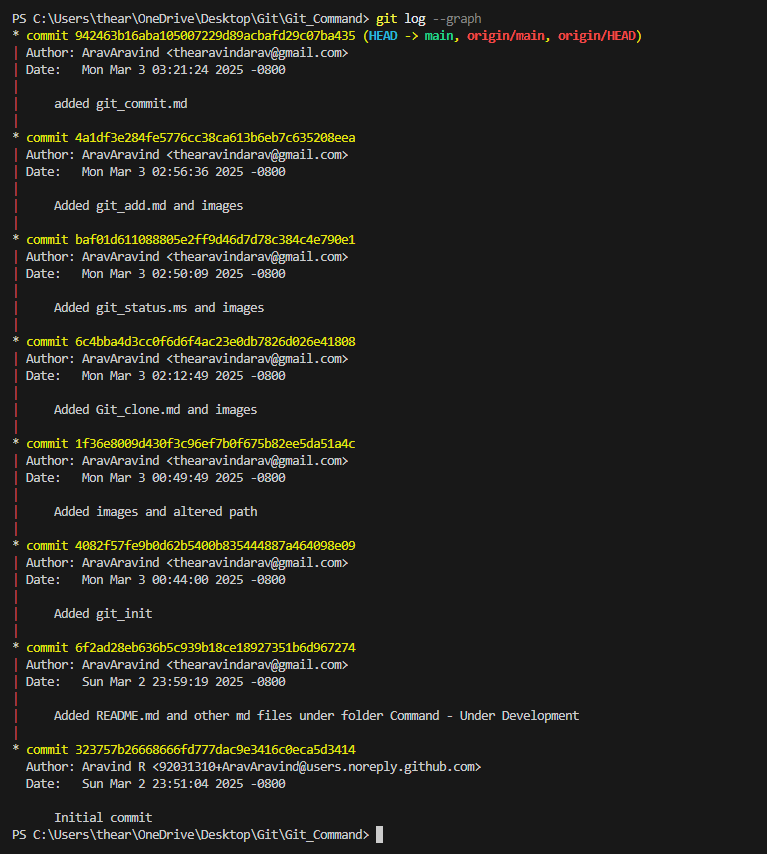
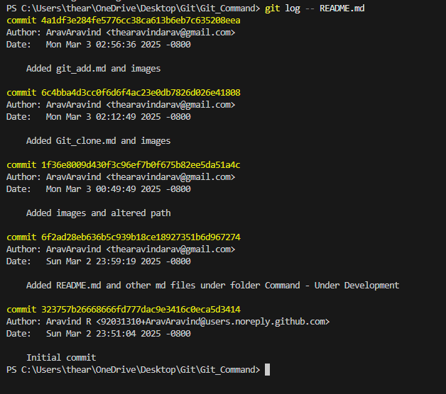
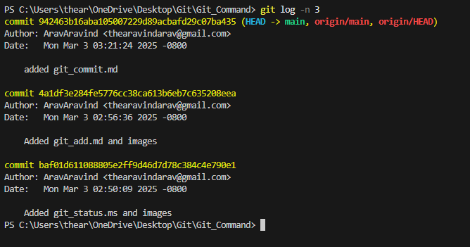
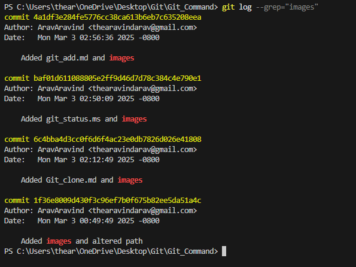
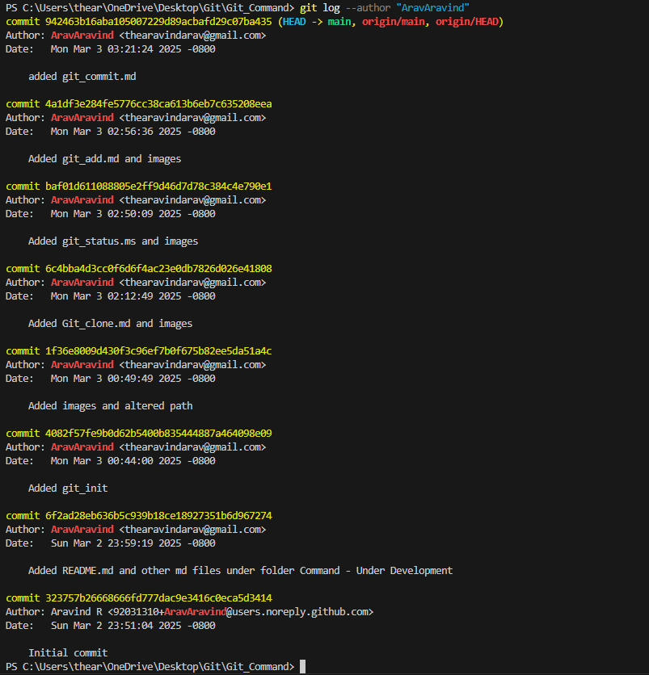

# Git Log Command  

## Overview  
The `git log` command displays the commit history of a repository. It shows commit hashes, authors, dates, and commit messages, allowing you to track changes over time.  

## Usage  

To view the commit history:  

```sh
git log
```  


## Example  

A basic `git log` output may look like this:  

```sh
commit abc1234567890def
Author: John Doe <johndoe@example.com>
Date:   Mon Mar 3 12:34:56 2025 +0530  

    Added new feature to user dashboard  

commit def7890123456abc
Author: Jane Smith <janesmith@example.com>
Date:   Sun Mar 2 10:20:30 2025 +0530  

    Fixed login issue  
```  

To display logs in a single line per commit:  

```sh
git log --oneline
```  


To see logs with graphical representation:  

```sh
git log --graph
```  


To view the history of a specific file:  

```sh
git log -- <file_name>
```  


To limit the number of commits displayed:  

```sh
git log -n <number>
```  


## Filtering Logs  

To search for commits with a specific keyword in the message:  

```sh
git log --grep="fix"
```  


To show commits by a specific author:  

```sh
git log --author="John Doe"
```  


## Conclusion  

The `git log` command is useful for reviewing commit history, tracking changes, and understanding the development timeline of a project.  
