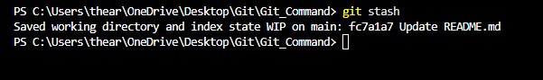
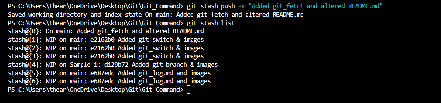
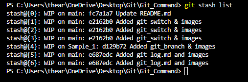
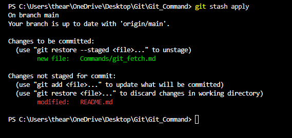
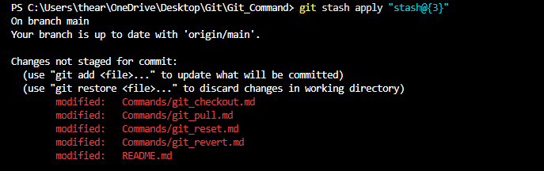
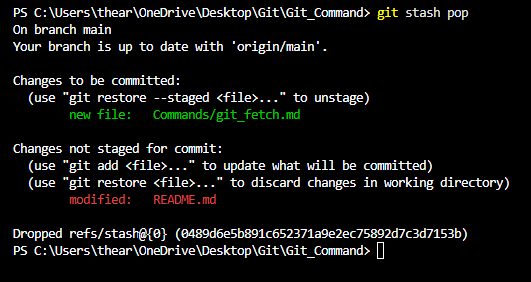
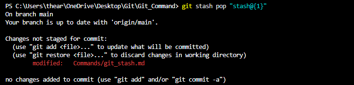
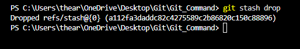
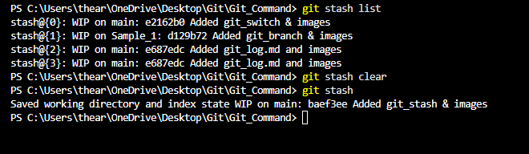
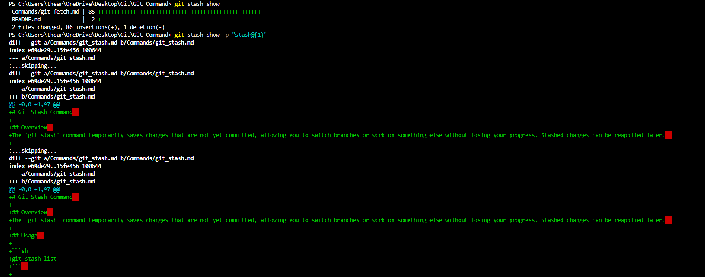

# Git Stash Command  

## Overview  
The `git stash` command temporarily saves changes that are not yet committed, allowing you to switch branches or work on something else without losing your progress. Stashed changes can be reapplied later.  

## Usage  

### Save uncommitted changes  

```sh
git stash
```  


### Save changes with a custom message  

```sh
git stash push -m "Work in progress on feature X"
```
  

### List all stashes  

```sh
git stash list
```  


### Apply the most recent stash  

```sh
git stash apply
``` 
 

### Apply a specific stash  

```sh
git stash apply stash@{n}
```  


### Apply and remove the most recent stash  

```sh
git stash pop
```  


### Apply and remove a specific stash  

```sh
git stash pop stash@{n}
```  


### Remove a specific stash  

```sh
git stash drop stash@{n}
```  


### Remove all stashes  

```sh
git stash clear
```  


## Example  

### Stashing Changes  

```sh
git stash
```  

### Switching Branches Without Losing Work  

```sh
git stash
git switch main
```  

### Applying the Last Stash  

```sh
git stash apply
```  

### Applying and Removing a Stash  

```sh
git stash pop
```  

### Viewing Stashed Changes  

```sh
git stash show -p stash@{0}
```  


## Conclusion  

The `git stash` command is useful for temporarily setting aside work, switching contexts, and resuming progress without committing incomplete changes.  
