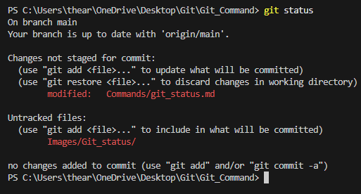

# Git Status Command  

## Overview  
The `git status` command displays the current state of the working directory and the staging area. It helps you track changes, see which files are modified, untracked, or staged for the next commit.  

## Usage  

To check the status of your Git repository, use:  

```sh
git status
```  

## Example  

After modifying files, running:  

```sh
git status
```  

Might output something like:  

```sh
On branch main  
Your branch is up to date with 'origin/main'.  

Changes not staged for commit:  
  (use "git add <file>..." to update what will be committed)  
  (use "git restore <file>..." to discard changes in working directory)  

    modified:   file1.txt  

Untracked files:  
  (use "git add <file>..." to include in what will be committed)  

    newfile.txt  

no changes added to commit (use "git add" and/or "git commit -a")  
```  

## Understanding the Output  

- **Changes not staged for commit**: Files that have been modified but are not yet staged.  
- **Untracked files**: New files that Git is not tracking yet.  
- **No changes added to commit**: No files are staged for commit.  



## Conclusion  

The `git status` command is essential for monitoring changes in your repository. It helps identify which files need to be staged, committed, or ignored.  
