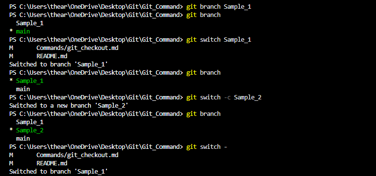

# Git Switch Command  

## Overview  
The `git switch` command is used to switch between branches in a Git repository. It was introduced in Git 2.23 as a simpler alternative to `git checkout` for branch switching.  

## Usage  

### Switch to an existing branch  

```sh
git switch <branch_name>
```  

### Create and switch to a new branch  

```sh
git switch -c <branch_name>
```  

### Switch to a previous branch  

```sh
git switch -
```  

### Switch to a remote-tracking branch and create a local branch  

```sh
git switch --track origin/<branch_name>
```  

## Example  

### Switching to an Existing Branch  

```sh
git switch develop
```  

### Creating and Switching to a New Branch  

```sh
git switch -c feature-branch
```  

### Switching Back to the Last Used Branch  

```sh
git switch -
```  

### Tracking a Remote Branch Locally  

```sh
git switch --track origin/new-feature
```  


## Difference Between `git switch` and `git checkout`  

- `git switch` is only for switching branches, making it safer and more intuitive.  
- `git checkout` can be used for both switching branches and restoring files, which can be confusing.  
- `git switch` is recommended in modern Git workflows.  

## Conclusion  

The `git switch` command simplifies branch switching and is a preferred alternative to [`git checkout`](git_checkout.md) for managing branches.  
